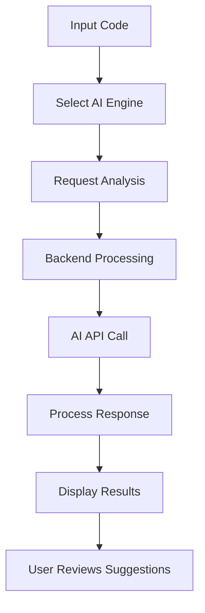

# AI-code-Reviewer
# 🤖 AI Code Reviewer


[](https://opensource.org/licenses/MIT)

<p align="center">
  
</p>

> 🚀 Enhance your code quality with AI-powered code reviews, suggestions, and automated improvements.

## ✨ Features

- 🔍 **Smart Code Analysis**: Get detailed insights into your code quality, potential bugs, and improvement areas
- 🤖 **Multi-AI Integration**: Choose between Google Gemini, Deepseek AI, and more for your code reviews
- 🖼️ **Image Generation**: Generate diagrams and visual representations of your code
- 📝 **Syntax Highlighting**: Beautiful code display with Prism.js
- 📱 **Responsive UI**: Works smoothly on both desktop and mobile devices
- 🔄 **Real-time Feedback**: Instant AI analysis as you type or upload code

## 🛠️ Tech Stack

### Frontend
- ⚛️ React 19 with Vite
- 🎨 TailwindCSS for styling
- 📦 React Markdown & Prism.js for code display
- 🔌 Axios for API communication

### Backend
- 🟢 Node.js with Express 5
- 🧠 Google Gemini AI
- 🔮 Deepseek AI
- 🖼️ Hugging Face for image generation
- 🔒 dotenv for environment variable management

## 📋 Prerequisites

- Node.js 18+
- npm or yarn
- API keys for:
  - Google Gemini AI
  - Deepseek AI
  - Hugging Face (optional, for image generation)

## 🚀 Installation

### Clone the repository

```bash
git clone https://github.com/yourusername/AI-code-Reviewer.git
cd AI-code-Reviewer
```

### Backend Setup

```bash
cd Backend
npm install

# Create a .env file with your API keys
echo "GEMINI_API_KEY=your_gemini_api_key
DEEPSEEK_API_KEY=your_deepseek_api_key
HUGGINGFACE_API_KEY=your_huggingface_api_key" > .env

# Start the backend server
npm start
```

### Frontend Setup

```bash
cd Frontend
npm install
npm run dev
```

The app will be running at http://localhost:5173

## 📷 Screenshots

<p align="center">
  
</p>

<p align="center">
  
</p>

## 📝 Usage

1. 📋 Paste your code into the editor or upload a file
2. 🤖 Select your preferred AI engine (Gemini, Deepseek)
3. 🔍 Click "Review Code" to get AI-powered suggestions
4. 📊 Explore the detailed analysis and recommendations
5. 🖼️ Generate visual representations with the "Generate Diagram" feature

## 🔄 Workflow



## 🤝 Contributing

Contributions are welcome! Please feel free to submit a Pull Request.

1. Fork the repository
2. Create your feature branch (`git checkout -b feature/amazing-feature`)
3. Commit your changes (`git commit -m 'Add some amazing feature'`)
4. Push to the branch (`git push origin feature/amazing-feature`)
5. Open a Pull Request

## 📄 License

This project is licensed under the MIT License - see the [LICENSE](LICENSE) file for details.

## 🙏 Acknowledgements

- [Google Gemini AI](https://ai.google.dev/)
- [Deepseek AI](https://www.deepseek.com/)
- [Hugging Face](https://huggingface.co/)
- [React](https://reactjs.org/)
- [Vite](https://vitejs.dev/)
- [Express](https://expressjs.com/)

---

<p align="center">
  Made with ❤️ by Your Name
</p>
